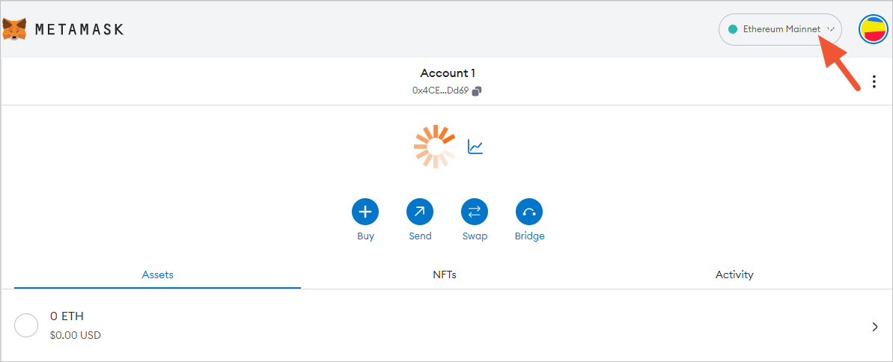
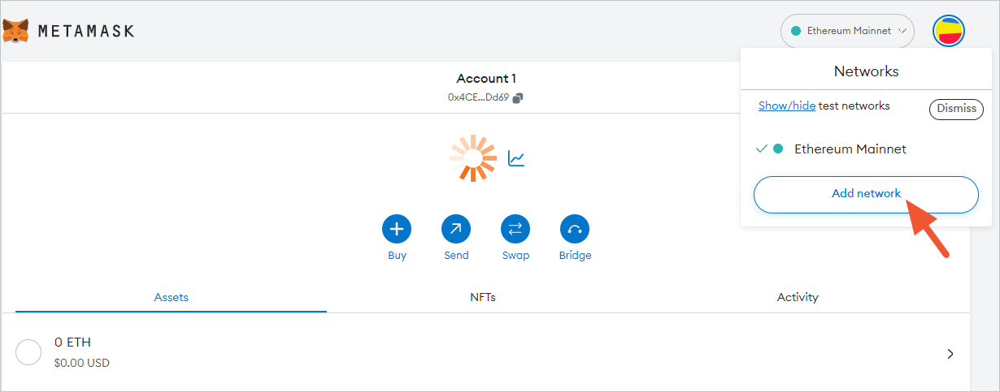
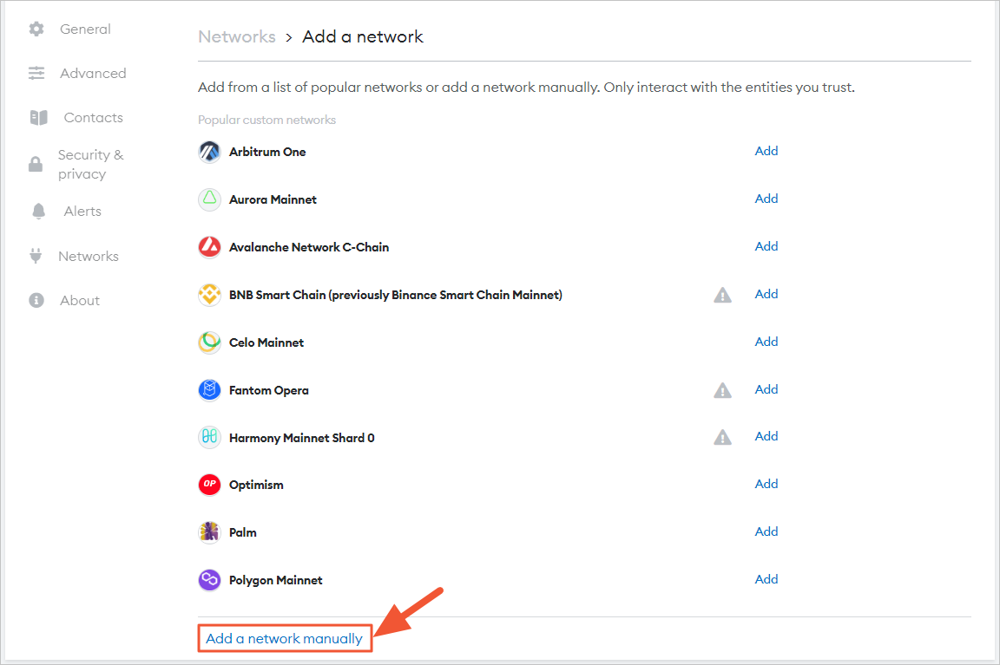
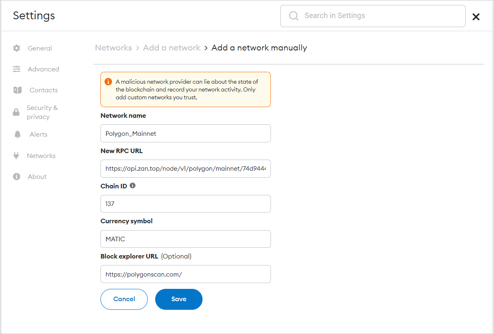
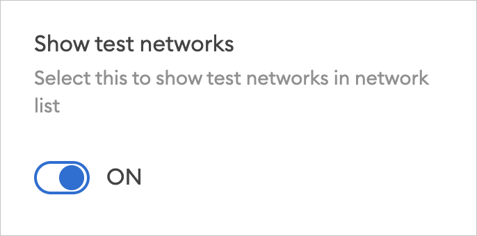
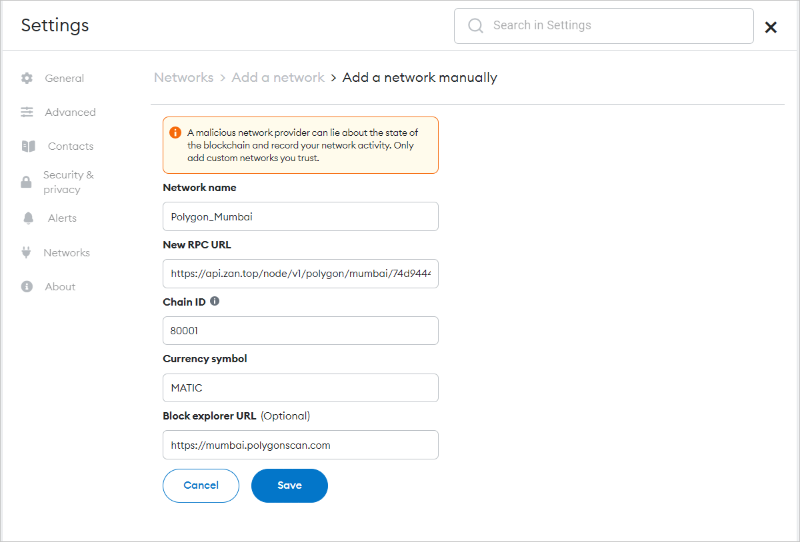

# 在MetaMask中添加RPC节点
添加以太坊、Polygon、BSC RPC节点到MetaMask的步骤完全相同。本教程主要以 Polygon 为例，指导您如何在MetaMask中添加Polygon Mainnet 和 Mumbai Testnet的自定义RPC节点服务网络。您只需几个步骤，就可以将 Polygon 添加到 Metamask。

## 添加网络的步骤
1. [创建一个ZAN帐户](#第一步创建一个zan帐户)
2. [创建MetaMask上配置网络所需的API Key](#第二步创建metamask上配置网络所需的api-key)
3. [复制您的网络连接地址](#第三步复制您的网络连接地址)
4. [添加网络](#第四步-添加网络)

## 第一步：创建一个ZAN帐户
我们需要在ZAN上创建一个在MetaMask上用于配置RPC节点服务网络的API Key，首先应该要有一个ZAN帐户，您只需参考[这里](/zh-CN/guide/getting-started#-准备一个zan系统的账户).

## 第二步：创建MetaMask上配置网络所需的API Key
如果你需要在MetaMask上配置我们为你提供的RPC节点服务网络，那么您需要在ZAN上创建一个用于连接节点时进行校验的API Key。
您可以[在 ZAN 上创建您的 API Key](/zh-CN/guide/getting-started#创建一个api-key)，创建完成后，即可获得ZAN目前所支持的所有区块链主网和测试网的连接地址。

## 第三步：复制您的网络连接地址
创建API Key后，您可以在这里获取到用于 Metamask 中 RPC URL 的链接地址。点击具体区块链模块右上角的下拉菜单，可以自由切换网络，如测试网、主网等，不同的网络下提供不同的链接地址。点击 HTTPS 链接地址右侧的 **Copy** 按钮，即可快捷复制该链接地址，具体参见[获取 API Key 信息](/zh-CN/guide/getting-started#获取api-key-的信息)。

以下当前ZAN平台支持的区块链网络链接地址清单：

| **Network**              | **HTTPS URL**                                        | **WSS URL**                                             | **Chain ID** | **Symbol** |
|--------------------------|------------------------------------------------------|---------------------------------------------------------|--------------|------------|
| Ethereum Mainnet         | https://api.zan.top/node/v1/eth/mainnet/{apikey}     | https://api.zan.top/node/ws/v1/eth/mainnet/{apikey}       | 1            | ETH        |
| Ethereum Testnet goerli  | https://api.zan.top/node/v1/eth/goerli/{apikey}      | https://api.zan.top/node/ws/v1/eth/goerli/{apikey}      | 5            | ETH        |
| Ethereum Testnet sepolia | https://api.zan.top/node/v1/eth/sepolia/{apikey}     | https://api.zan.top/node/ws/v1/eth/sepolia/{apikey}     | 11155111  | ETH        |
| Polygon Mainnet          | https://api.zan.top/node/v1/polygon/mainnet/{apikey} | https://api.zan.top/node/ws/v1/polygon/mainnet/{apikey} | 137          | MATIC      |
| Polygon Mumbai           | https://api.zan.top/node/v1/polygon/mumbai/{apikey}  | https://api.zan.top/node/ws/v1/polygon/mumbai/{apikey}  | 80001        | MATIC      |
| BSC Mainnet              | https://api.zan.top/node/v1/bsc/mainnet/{apikey}     | https://api.zan.top/node/ws/v1/bsc/mainnet/{apikey}     | 56           | BNB        |

## 第四步: 添加网络
以下将分别给出了添加Polygon主网和添加Polygon测试网络的步骤。

### 添加Polygon主网
1. 打开 MetaMask 并单击位于窗口右上角的网络名称。
   

2. 单击弹出窗口底部的 **Add Network** 按钮。
   

3. 您需要手动添加您的网络，点击页面左下方的 Add a network manually 即可开始添加。
    

   <Alert type="info">
   📘 <b>说明</b>：在列表中如果有您想要添加的主流网络，也可以直接单击 <b>Add</b> 按钮进行快速添加，例如 <b>Polygon Mainnet</b>。
   </Alert>

4. 输入以下网络详细信息，并单击保存。
   

   | 参数                     | 说明                                                                           |
   |------------------------|------------------------------------------------------|
   | **Network Name**       | 网络名称，便于区别不同网络，如果是自定义网络，建议直接使用网络名，如 ETH Mainnet。                                                 |
   | **New RPC URL**        | 消息服务器地址，告诉 MetaMask 钱包向哪发送交易请求，不同的链有固定的服务器。请填写您在ZAN控制台上获取的网络连接地址，获取方式详见[第三步](#第三步复制您的网络连接地址)。 |
   | **Chain ID**           | 链 ID，用于签署交易，不同的链会有固定的 ID，在获取网络配置时需要提供，如 Polygon 的链 ID为1。                                        |
   | **Currency Symbol**    | 显示这个网络的基础代币，以太坊主网就是 ETH、BSC 网络是 BNB、Polygon 网络是 MATIC 等。                                        |
   | **Block Explorer URL** | 区块链浏览器，用于查看交易详情等，如Polygon的区块链浏览器地址为：https://etherscan.io/。                                      |

点击Save后，下拉列表中会直接切换到 Polygon Mainnet。

恭喜你！您已成功完成了添加polugon主网的所有配置。

### 添加Polygon测试网 (Mumbai)

孟买测试网复制了用于测试的多边形主网。添加测试网的操作步骤与添加主网的操作基本相同，唯一不同的是RPC节点服务网络的不同。

1. 首先，请确保您已启用 **Show test networks toggle**。
   打开这个开关后，可以在网络列表中展示所有默认的测试网络。您可以在**设置** > **高级** > **显示测试网络** 中找到并开启它。
   

2. 输入以下网络详细信息，并单击保存。
   
   相关参数的配置说明，请参见 Updating Polygon Mainnet 的[步骤4](#添加polygon主网)。
