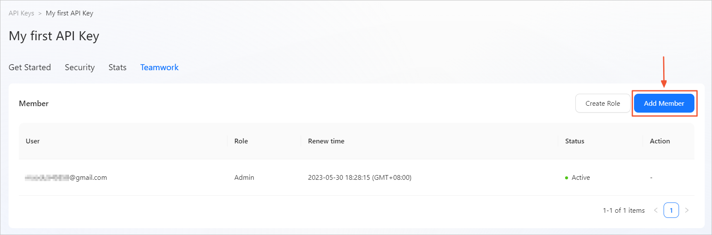
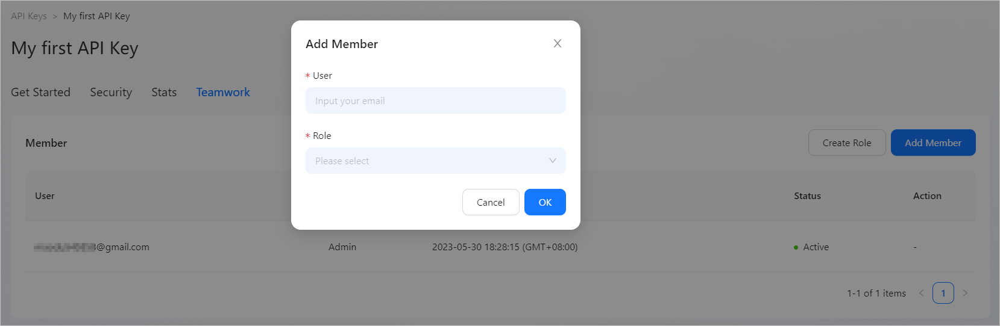
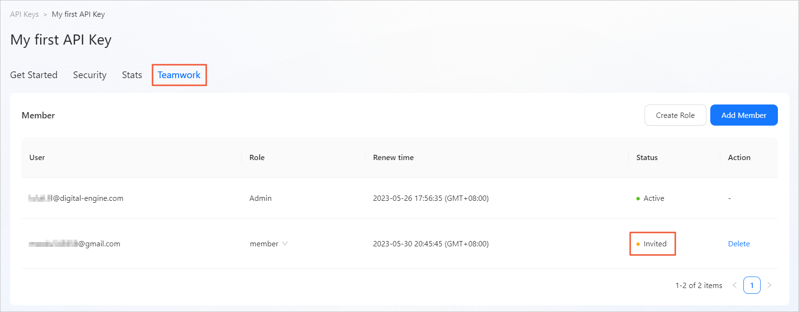
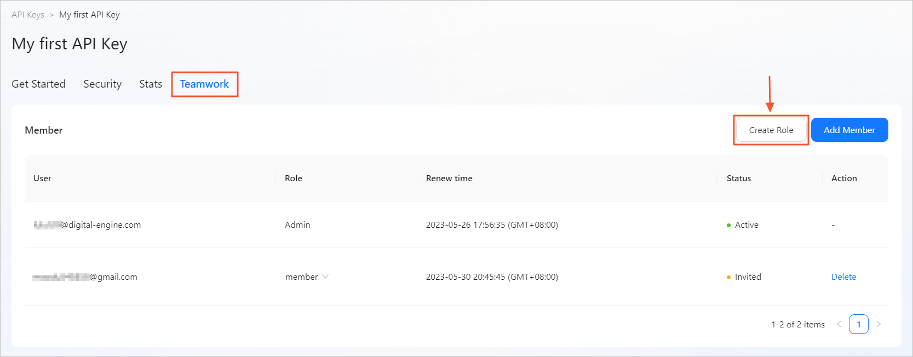
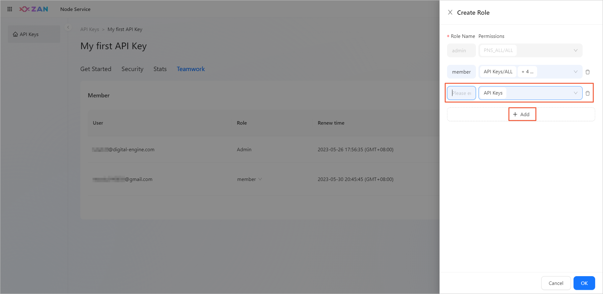
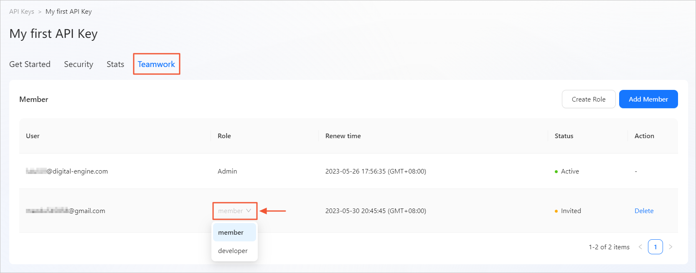
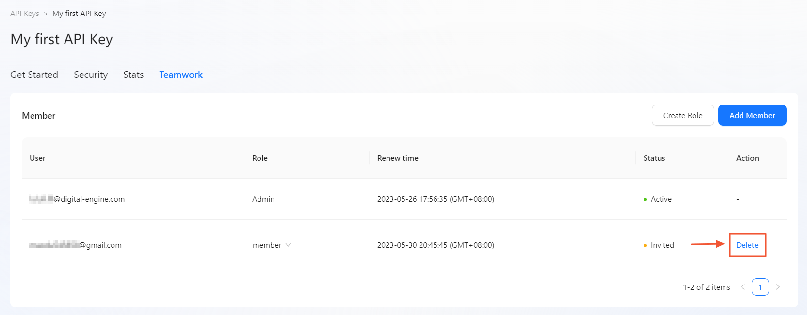

# Configuring collaboration settings for API keys
After you create an API key, you can share it with other members. You can also configure permissions for each member to implement collaborative development in your project team. 

## Overview
Fast collaboration for engineering efficiency improvement.
In this chapter, you will be able to set the current API Key for members with different permissions:
- **Member collaboration**
   Members can share existing API keys. 
- **Custom permissions**
   Permissions can be configured and granted to each member separately. 

## Description
- Credit consumption: After members are added for an API key, all the credits consumed by the API key are counted on the creator of the API key. 
- Creator: By default, the creator of an API key has the permissions of the Admin role on the key. 
- Member: The management permissions of a member on an API key are the same as the role permissions granted to the member on Teamwork. 

### Configuration path
Move the pointer over the target API key panel, and click **Action**. On the **Teamwork** tab of the API key management page, you can add members for the API key and assign roles with different permissions to the members. 

<Alert type="info">
<b>Note</b>: Only API key creators and members who have the Teamwork management permissions can do the following settings. 
</Alert>

### Adding members
You can add multiple members for an API key based on the following method:
1. On the **Teamwork** tab, click **Add Member**. 
   

2. In the dialog box that appears, enter the email address of the desired member and select a role for the member. 
   

3. Click **OK**. Then, the ZAN platform sends an email to the member. 
   At the same time, a member information with status as invited is generated under your member list.
   

4. After the member confirms the details in the email, the member becomes a project member of the API key. 

### Creating custom roles
By default, the platform provides the **Admin** role. If you want to create more roles that have different permissions, perform the following steps:
1. On the **Teamwork** tab, click **Create Role**. 
   

2. In the right-side panel that appears, click **Add** to add a new role. 
3. Enter a role name and specify the corresponding permissions as shown in the following figure. 
   
   <Alert type="info">
   <b>Note</b>: On this page, you can also modify or delete roles that have been created previously.
   </Alert>
   The platform provides a total of eight permission options, which are obtained by combining operation permissions and viewing permissions based on the following four permission modules. 
   | Permission module     | Operation permission (All)   | Viewing permission (Only View)                                                |
   |----------|--------------|----------------------------------------------------------------|
   | API Keys | None.            | Permission to view. By default, all roles are granted this permission.                                         |
   | Security | Permission to enable/disable key authentication.    | Permission to view.                                                            |
   | Security | Permission to edit a contract address allowlist.    | Permission to view.                                                           |
   | Security | Permission to edit an IP address allowlist.    | Permission to view.                                                            |
   | Security | Permission to edit an API request method allowlist. | Permission to view.                                                            |
   | Security | Permission to edit the request cost limit.     | Permission to view.                                                            |
   | Stats    | None.            | Permission to view all monitoring information, including information in the Credit Cost (Last 24 hours), Requests, Requests activity, and Requests Origin modules.  |
   | Teamwork | Permission to create/edit roles.      | Permission to view the list.                                                          |
   | Teamwork | Permission to add members.       | Permission to view the list.                                                          |
   | Teamwork | Permission to delete members.       | Permission to view the list.                                                          |
   | Teamwork | Permission to change the role of a member.     | Permission to view the list.                                                          |

4. If you want to add more roles, click **Add** again. 
5. After you add all the roles that you want, click **Yes** in the lower-right corner. 

### Modifying the role of a member
On the **Teamwork** tab, you can view the information about all the members of the API key in a list. If you want to change the role of a member, switch the role in the **Role** column. 

### Deleting a role
On the **Teamwork** tab, you can view the information about all the members of the API key in a list. If you want to delete a member, click **Delete** in the **Action** column. The member is deleted after your confirmation. 
