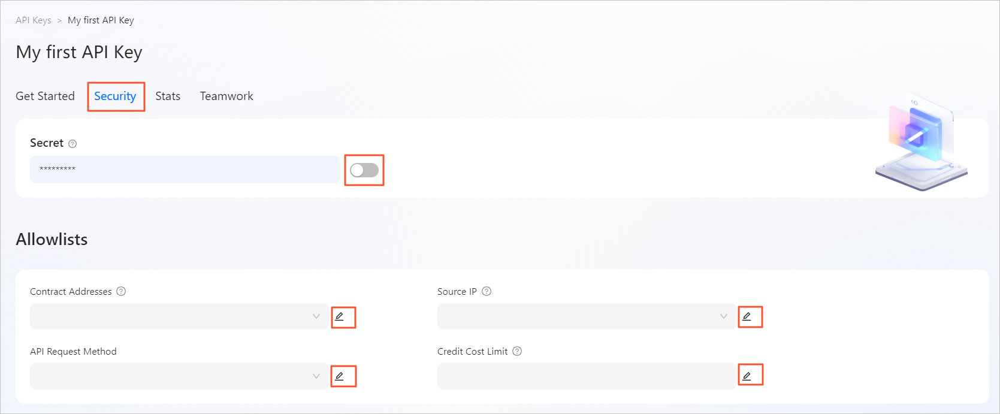

# 👷 Security settings
You can configure security settings for your API key, including secret-based two-factor authentication on connections, the contract address allowlist, the source allowlist, the API request method allowlist, and the upper limit of credit consumption. 

## Overview
Priority: security protection.
In this chapter, you will be able to configure the following security Settings:
- **Secret-based two-factor authentication**
   You can enable secret-based two-factor authentication to ensure access security. 
- **Allowlist control**
   - Contract address allowlist: You can limit the accessible contract addresses to prevent abuse of API keys. 
   - Source allowlist: You can control the source IP addresses from which access requests can be initiated. 
- **Credit usage control**
   - You can implement fine-grained control over the methods that can be called by using an API key. 
   - You can set the upper limits of credit usage for API keys.

## Configuration path
Move the pointer over the target API key panel, and click **Action**. On the **Security** tab of the API key management page, you can configure the settings to secure API key-based connections.

You can configure the following settings to secure API key-based connections:
- [Configuring secret-based two-factor authentication](#configuring-secret-based-two-factor-authentication)
- [Setting a contract address allowlist](#setting-a-contract-address-allowlist)
- [Setting a source allowlist](#setting-a-source-allowlist)
- [Setting an API request method allowlist](#setting-an-api-request-method-allowlist)
- [Setting the request cost limit](#setting-the-request-cost-limit)

## Configuring secret-based two-factor authentication
By default, the system generates a secret for two-factor authentication for your API key. You can enable the secret to enable two-factor authentication, which can ensure access security. 
- Enable the secret.
   If the secret is disabled, toggle the switch on the right side of **Secret**. After your confirmation, the secret-based two-factor authentication feature is enabled for your API key. After the secret is enabled, all requests must undergo two-factor authentication by using the secret. The system allows access only after the authentication succeeds. 
- Disable the secret.
   If the secret is enabled, toggle the switch on the right side of **Secret**. After your confirmation, the secret-based two-factor authentication feature is disabled for your API key. After the feature is disabled, the system no longer uses this secret to perform two-factor authentication on subsequent requests. 

## Setting a contract address allowlist
You can configure a contract address allowlist to limit the accessible contract addresses to prevent the abuse of your API key.
If your application only queries data from specific Ethereum smart contracts or addresses, add those addresses to the contract addresses allowlist.
Any requests which query addresses that are not in the allowlist are rejected.
The following RPC methods take an Ethereum address parameter and are compatible with type of allowlisting:
- eth_call
- eth_estimateGas
- eth_getLogs
- eth_getBalance
- eth_getCode
- eth_getStorageAt
- eth_getTransactionCount

In the **Allowlists** module, add contract addresses in **Contract Addresses** to configure the allowlist. 
- If no contract addresses are specified in the contract address allowlist, the allowlist is disabled by default and all contracts are accessible. 
- After you add contract addresses to the contract address allowlist, only contracts with the specified addresses can be called by the API.
   To add contract addresses, click the Edit icon, specify one or more contract addresses, and then click **Save**.
   To modify the contract address allowlist, click the Edit icon, delete existing contract addresses as needed, and then click **Save**. 

## Setting a source allowlist
You can configure a source allowlist to specify the IP addresses that can be used to initiate access requests.
In the **Allowlists** module, add IP addresses in **Source IP** to configure the allowlist. 
- If no IP addresses are specified in the source allowlist, the allowlist is disabled by default and access requests from all IP addresses are allowed. 
- After you add IP addresses to the source allowlist, only requests from the specified IP addresses are allowed.
   To add IP addresses, click the Edit icon, specify one or more IP addresses, and then click **Save**.
   To modify the source allowlist, click the Edit icon, delete existing IP addresses as needed, and then click **Save**. 

## Setting an API request method allowlist
You can configure an API request method allowlist to implement fine-grained control over the methods that can be called by using an API key.
In the **Allowlists** module, add specific API request methods in **API Request Methods** to configure the allowlist. 
- If no API request methods are specified in the API request method allowlist, the allowlist is disabled by default and all API request methods can be called. 
- After you add API request methods to the API request method allowlist, only the specified API request methods can be accessed by using this API key.
   To add API request methods, click the Edit icon, specify one or more API request methods, and then click **Save**.
   To modify the API request method allowlist, click the Edit icon, delete the existing API request methods as needed, and then click **Save**. 

## Setting the request cost limit
You can configure the upper limit of credits that can be consumed for an API key to implement control over credit usage.
In the **Allowlists** module, specify the maximum number of credits that can be consumed in **Request Cost Limit** to configure the upper limit of credit usage. The unit is million. 
- If you do not configure an upper limit, the system does not reject the requests to this API even when an excessive number of credits are consumed. 
- After you configure the upper limit, the system rejects the requests to this API when the upper limit is reached.
   To configure the upper limit of credit usage, click the Edit icon, specify an upper limit, and then click **Save**.
   To modify the upper limit of credit usage, click the Edit icon, specify another upper limit, and then click **Save**.