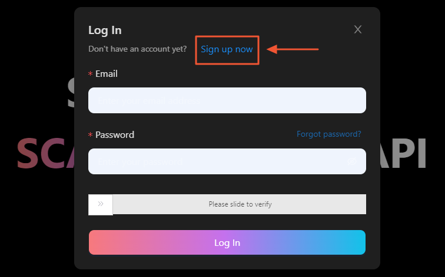
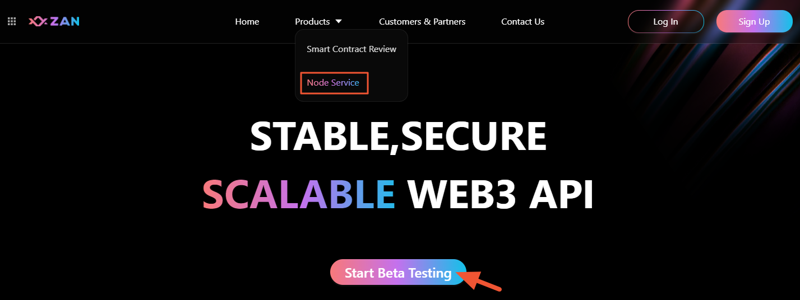
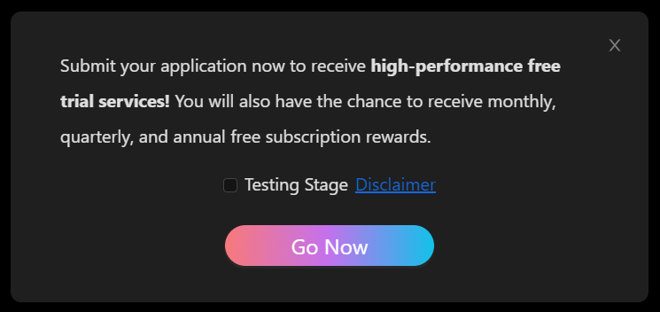
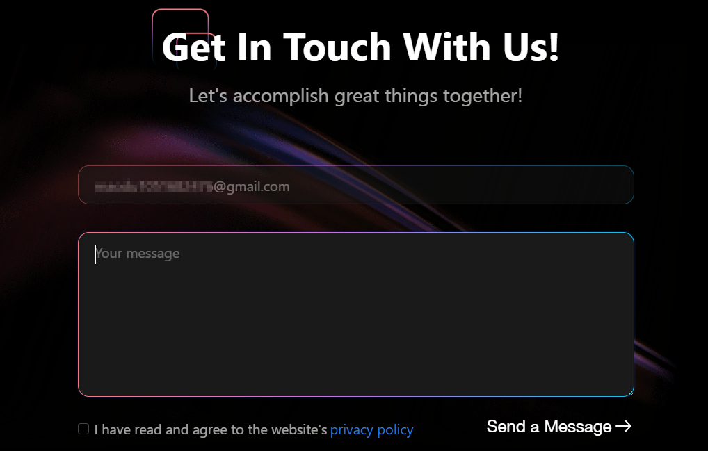
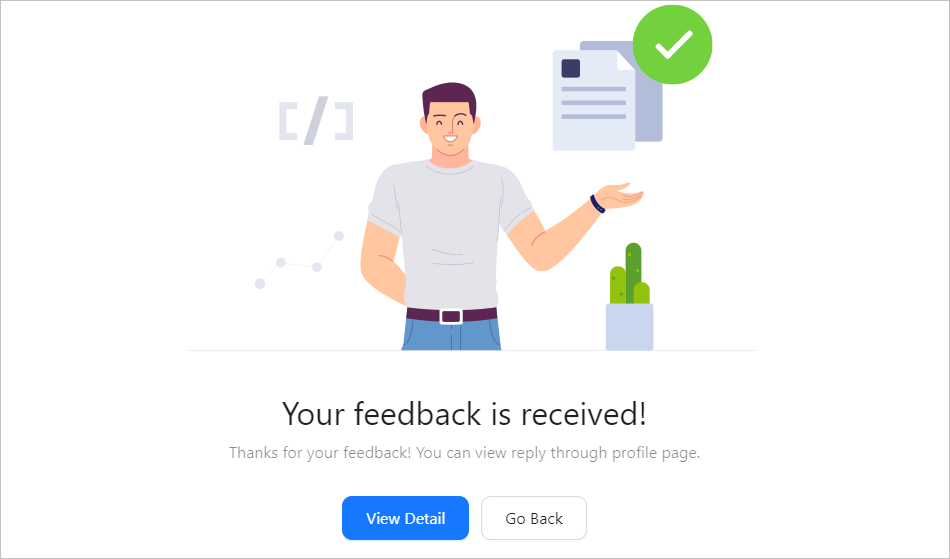
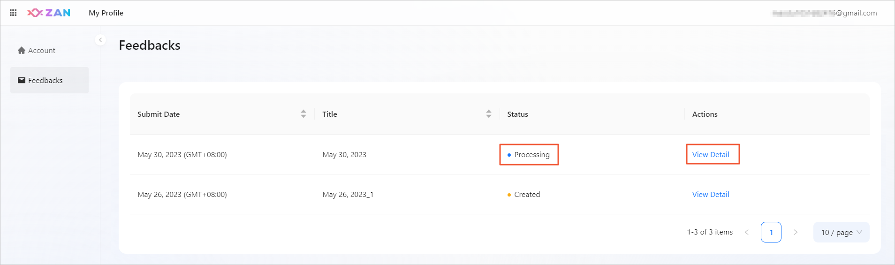
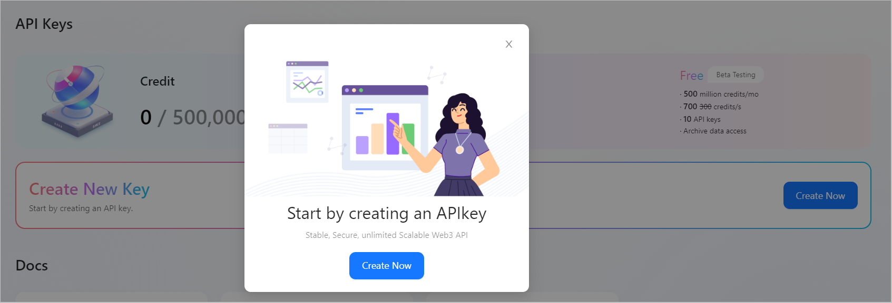
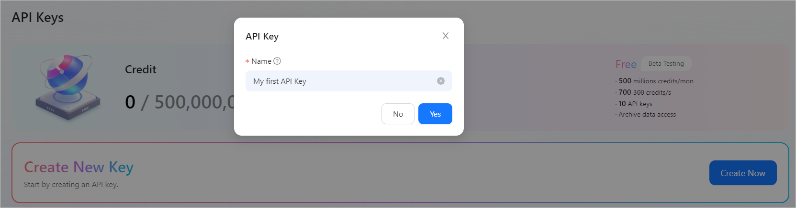
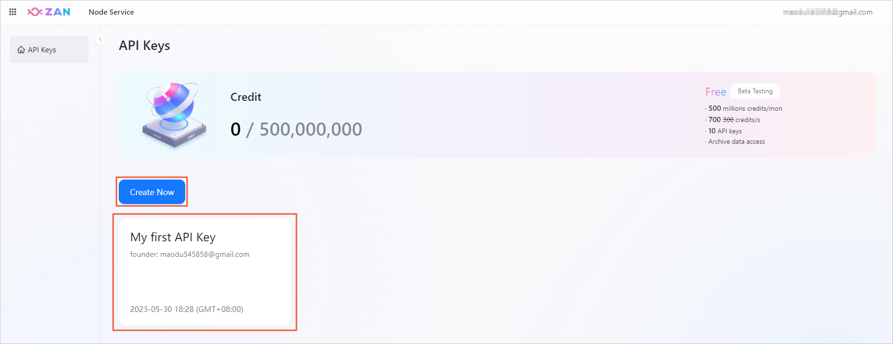
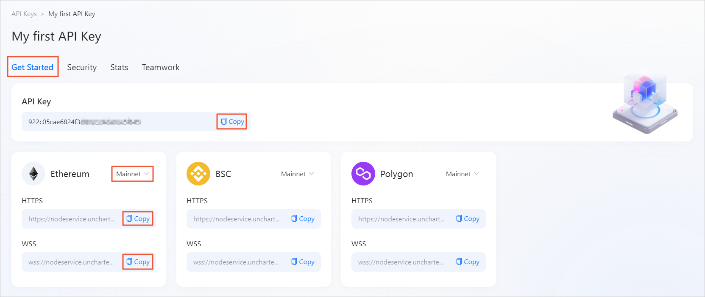

# 🚀 Getting started
## Overview
Quick start.
After learning this chapter, you can gain:
- **Quick connection to the world of Web3**
   You can access all supported public blockchains by creating an API key, without additional configurations. 
- **Application isolation**
   You can create multiple API keys to isolate applications and secure production. 
- **Dual support for HTTPS and WSS**
   Connections can be established over HTTPS and WebSocket Secure (WSS). This can meet the different requirements of applications. 

For Web3 application developers, the cost of building nodes on public blockchains is relatively high, and the stability and security of the node running cannot be ensured. In this issue, a node service is available in public preview for free (valid for 30 days and allows you to create a maximum of ten API keys). To interact with blockchains through HTTPS/WSS, developers only need to get the API key that is required to establish connections to RPC nodes.
Before you use the node service to connect to blockchains, sign up for an account on the ZAN platform. Then, you can use this account to log in to the ZAN console and create the API keys required for Web3 application development. 

## 🔏 Preparing a ZAN account

### If you have not signed up for a ZAN account
Click **Start Bate Testing** on the product introduction page. The following login page appears. Click **Sign up now**, and create your ZAN account to sign up.

### Apply for high-performance free trial services
After completing the registration for your ZAN account, you can apply for our free trial qualification! The application process is as follows:
1. Click on **Start Beta Testing** on the product introduction page.
   

2. In the pop-up window, you can get information about the free Free beta version. After reading and selecting the disclaimer, click **Go Now**.
   

3. The page will automatically scroll to the bottom of the product page. Please fill in the reason for your application in the text box, read and check the agreement below, and then click **Send a message**.
   

4. After a successful application, the page will display the following message.
   

   You can click **View Detail** in the pop-up window to check the status of your application on the homepage.
   
   
   <Alert type="info">
   📘 <b>Note</b>：After we receive your application, we will provide feedback as soon as possible and notify you by email. Please check your email regularly.
   </Alert>

### If you have registered and successfully applied
Click **Start Beta Testing** on the product introduction page, enter your account and password, and the page will automatically redirect you to the product console to create an API Key required for connecting to node services.
For more information, see the **Creating your API key on the ZAN platform** section. 

## 🔑 Creating your API key on the ZAN platform

Before you get an API key on the ZAN platform, [sign up for an account](#-preparing-a-zan-account) on the ZAN official website. Then, log in to the ZAN console and start creating your first API key. 

### Creating an API key

You can create multiple API keys on the ZAN platform to isolate applications and secure production. You can access all supported public blockchains through each API key that you create, without additional configurations. The procedure for creating an API key is as follows:

1. After you log in to the ZAN console, if you have not created an API key, the following message appears, guiding you to create your first API key.
   

2. Click **Create Now**, and specify an API key name.
   Naming your API key can help you manage its application scenarios and purposes.
   

3. Click **Yes** to create the API key.
   Once the API key is created, you can view some basic information about the API key in the list, such as its name, creator, and creation time.
   

   On the left side of the page, you can view the maximum credits allowed by the current plan and the current usage. On the right side of the page, you can view your current plan. In this release, only the information about the free public preview edition plan is provided.
   <Alert type="info">
   📘 <b>Note</b>: The free public preview edition provides a free quota of 500 million credits by default. The system calculates the number of consumed credits based on the consumption of each RPC node. The number of consumed credits also varies based on the API methods that are called. For more information, see <a href="/guide/esource-pricing#credit-pricing-details">Credit pricing details</a>. 	
   </Alert>

### Getting API key information
After an API key is created, you can view the API key and the network URLs for the blockchains supported by the platform. 

#### View path
Move the pointer over the target API key panel, and click **Action**. On the **Get Started** tab of the API key management page, you can view the API key and the network URLs for each blockchain. 

<Alert type="info">
📘 <b>Note</b>: You can click <b>Copy</b> to the right side of the API key or network URL to copy the content. 
</Alert>

#### Connectable blockchains
You can connect to blockchains that the platform currently supports by using the API key you get. The platform currently allows you to connect RPC nodes to the following three blockchains. The platform will support more EVM-compatible blockchains and other blockchains in the future. 
- Ethereum
- BNB Smart Chain
- Polygon PoS

To help you directly get the network URLs of different blockchains, the platform automatically generates URLs concatenated with the API key for you, and provides HTTPS and WSS connection methods. 

Each blockchain supports multiple networks. To switch networks such as the testnet and mainnet, click the drop-down menu in the upper-right corner of the specific blockchain module. Different URLs are provided for different networks. You can click Copy to the right side of the URL to copy it. 

### 📚 What to do next
- Follow the steps described in the [Creating an API key](#creating-an-api-key) section to create more API keys.
   You can continue to create more API keys by clicking **Create New Key** on the page. The free public preview edition allows you to create a maximum of ten API keys. 
- Manage and configure the created API keys. 
   - [Configuring security settings for API keys](/guide/configuring-security-settings-for-api-keys)
   - [Monitoring API key status](/guide/monitoring-api-key-status)
   - [Configuring collaboration settings for API keys](/guide/configuring-collaboration-settings-for-api-keys)

[def]: ./images/start-bate-testing.png