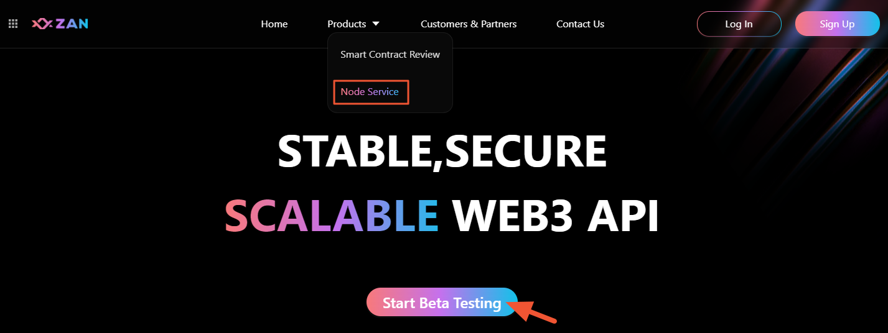
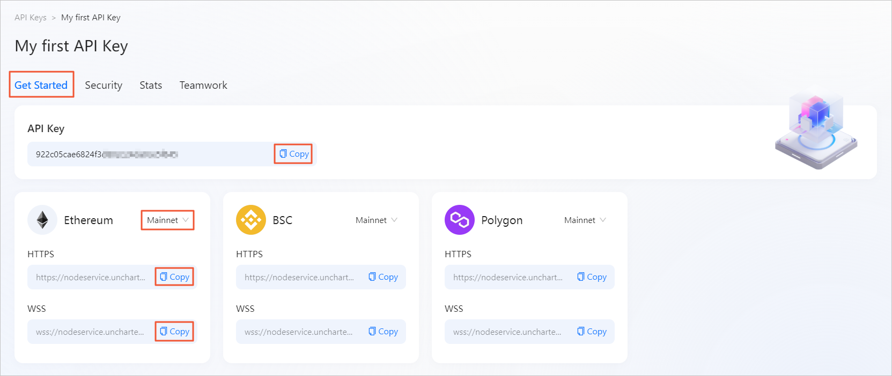

# 🚀 从这里开始

## 概述
一触即发，快速开始！
通过本章节的学习，您可以收获：
- **一键连接Web3世界**
   创建API Key，无需其他配置，即可快速访问所有支持的公链。
- **应用隔离**
   支持创建多个API Key，实现应用隔离，让生产更安全。
- **HTTPS/WSS双重支持**
   支持HTTPS及WSS两种连接方式，满足应用的不同诉求。

对于Web3应用开发者而言，在公链上搭建节点的成本是比较大的，并且也无法保证节点运行的稳定性及安全性。本期我们提供了一个免费公测版的节点服务（支持创建10个API Key，有效期30天），开发者只需获得与RPC 节点建立连接所需API Key，即可通过HTTPS/WSS方式与区块链进行交互。
在使用我们的节点服务连接区块链前，您需要注册一个 ZAN 系统的账户，使用该账户可以登录到 ZAN 控制台，即可在控制台上创建用于Web3应用开发所需 API Key。

## 🔏 准备一个ZAN系统的账户

### 如果您未注册ZAN账户
点击产品介绍页上的 **Start Bate Testing** 后，展示如下登录页。您需要点击 **Sign up now** ，完成ZAN账户的注册。

### 申请高性能免费试用服务
完成ZAN账户的注册之后，您就可以申请我们提供的免费试用资格啦！申请流程具体如下：
1. 再次点击产品介绍页上的 **Start Bate Testing** 。
   

2. 在弹框中，您可以获得有关免费公测版的活动信息，然后阅读并选购对应的免责声明后，点击 **Go Now**。
   

3. 页面自动定位到产品页底部，请在文本框中填写您申请的理由，阅读并勾选下方的协议后，点击 **Send a message**。
   

4. 申请成功后，页面提示如下。
   

   您可以点击弹窗中的 **View Detail**，在主页里查看申请状态。
   

   <Alert type="info">
   📘 <b>说明</b>：我们收到您的申请后，会尽快给予反馈，并以邮件的方式通知到您，请注意查收您的邮件。
   </Alert>

### 如果您已注册并成功申请服务
直接通过产品介绍页点击 **Start Bate Testing** ，输入您的账号及密码后，页面自动跳转至产品控制台创建用于连接节点服务时所需的API Key。
参见下一小节：**在ZAN上创建您的API Key**。

## 🔑 在ZAN上创建您的API Key

要取得ZAN系统的 API Key，您需要提前在ZAN官网上[注册一个账户](#-准备一个zan系统的账户)，之后登录到ZAN控制台，开始创建属于您的第一个 API Key。

### 创建一个API Key

用户可以在ZAN平台上创建多个API Key，实现应用隔离，让生产更安全。创建的每一个API key，无需其他配置，即可快速访问所有支持的公链。具体创建流程如下：

1. 登录ZAN控制台后，如果您还未创建过API Key，则会为您弹出如下提示框，引导您创建第一个API Key。
   

2. 点击 **Create Now** 后，您可以设置该API Key的名称。
   设置该名称，有助于您对该API Key所应用的场景及用途做一个管理。
   

3. 点击 **Yes** ，完成设置。
   创建API Key成功后，您会在列表下看到该API Key的一些基础信息，如 API Key 名称、创建者、创建时间这些信息。
   

   页面上方左侧展示的是当前套餐的Credit上限及目前使用情况，右侧则展示了您当前的套餐（本期仅提供免费的公测版）。 
   <Alert type="info">
📘 <b>说明</b>：免费的公测版，默认会赠送 500 Million的Credit，系统会根据您每个RPC 节点的消耗情况来计算Credit的消耗量，并且调用不同的API，消耗的Credit有所不同，具体可参见 <a href="/zh-CN/guide/esource-pricing#credit-定价明细">Credit 定价明细</a>。	
   </Alert>

### 获取API Key 的信息
创建 API key 后，支持查看该 API Key，及平台当前所支持的区块链在进行网络连接时的连接地址。

#### 查看路径
鼠标悬浮在已创建的目标 API Key 面板后，点击 **Action** ，在 API Key 管理页的 **Get Started** 功能页签下，可以查看该 API Key，以及连接各区块链的网络连接地址。

<Alert type="info">

📘 <b>说明</b>：点击 API Key、网络地址右侧的 <b>Copy</b> 按钮 ，可支持内容的快捷复制。

</Alert>

#### 支持连接的区块链
您可以通过获得的 API Key 与平台当前所支持的区块链进行连接。平台当前已支持与以下三条区块链建立 RPC 节点连接，后续将支持更多兼容EVM的区块链以及其他区块链。
- Ethereum
- BNB Smart Chain
- Polygon PoS

为了方便用户能够直接获取不同区块链的网络连接地址，平台已为您自动生成拼接了API Key后的连接地址，并且提供HTTPS、WSS两种连接方式。

点击具体区块链模块右上角的下拉菜单，可以自由切换网络，如测试网、主网等，不同的网络下提供不同的链接地址。点击链接地址右侧的 Copy 按钮 ，支持内容的快捷复制。

### 📚 后续步骤
- 参见[上文](#创建一个api-key)继续创建 API Key
  你可以继续点击页面上的 **Create New Key** ，创建更多的 API Key，免费的公测版最多可以创建10个。
- 对已创建的API Key进行管理和配置。
  - [API Key的安全性配置](/zh-CN/guide/configuring-security-settings-for-api-keys)
  - [API 使用状态情况](/zh-CN/guide/monitoring-api-key-status)
  - [API Key的协同设置](/zh-CN/guide/configuring-collaboration-settings-for-api-keys)

