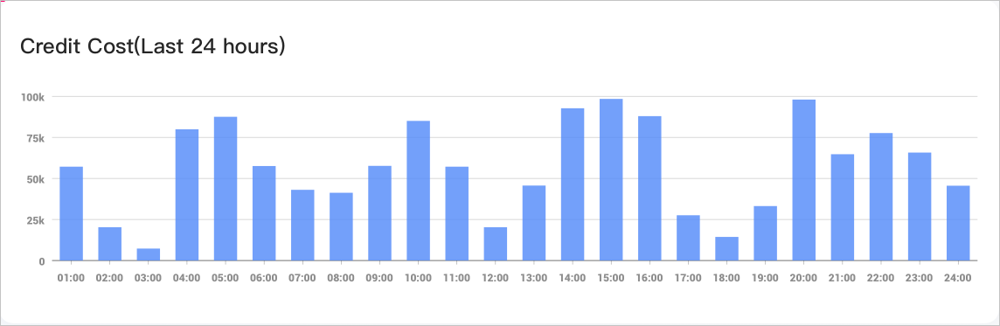
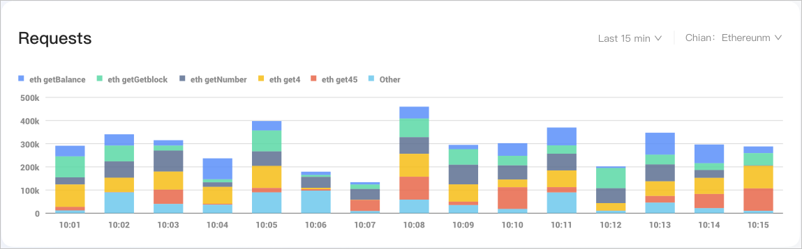
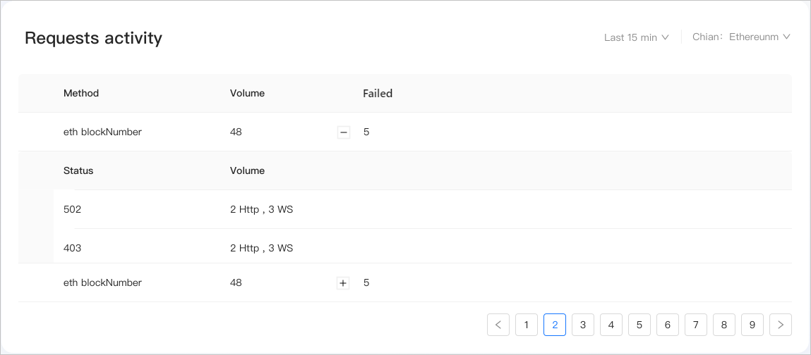
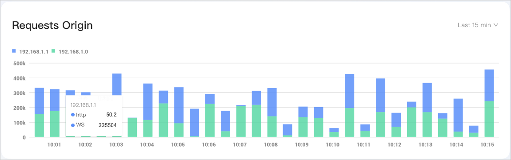

# API Key 状态监测
在该功能页，您可以全方位实时监控API Key的状态，包括 Credit 用量监控、Top5方法请求分布、请求状态监控、访问来源监控，以此来辅助您及时了解使用情况并快速作出响应。

## 概述
实时监控，尽在掌握！
节点服务提供全方位实时监控API Key状态的能力，具体可监控以下几个模块：
- **Credit用量波动监控**
  检测当前API Key在24h内的资源消耗情况。
- **Top5方法请求分布**
  提供15 min、1 h、24 h、7 days、1 month时间内，访问量前五名的方法调用情况及比例分布。
- **请求报错监控**
  提供15 min、1 h、24 h、7 days、1 month时间内，所有的调用请求，重点提示失败请求的状态原因。
- **访问来源监控**
  提供15 min、1 h、24 h、7 days、1 month时间内，该API Key由哪些来源进行了方法请求动作。

## 查看路径
鼠标悬浮在已创建的目标 API Key 面板后，点击 **Action** ，在 API Key 管理页的 **Stats** 功能页签下，可以全方位实时监控API Key的一些状态信息。

## Credit 用量监控
**Credit Cost ( Last 24 hours)** 模块，检测的是当前 API Key 在近24小时内的Credit的资源消耗情况，按每小时的间隔进行统计。

## Top5 方法请求分布
**Requests** 模块，提供了15 min、1 h、24 h、7 days、1 month时间内，访问量前五名的方法调用情况及比例分布。
条形图中，每一个色块代表一种API方法的访问次数。条形图的长度代表当下时间点的请求总量。鼠标悬浮后，会显示当下时间点调用量前五的方法和一个其他方法的请求数比例分布情况。

**支持的操作**
- 右上角支持查询时间选择，支持按15 min、1 h、24 h、7 days、1 month进行选择。
- 右上角支持链选择，可选范围为当前平台支持的所有区块链。
- 点击图表上方的方法，则取消在图上的显示，同理再次点击则在表上进行显示。

## 请求状态监控
**Requests activity** 模块，提供了15 min、1 h、24 h、7 days、1 month时间内的所有调用请求，并重点提示失败请求的状态原因。

**参数说明**
- method：具体的调用方法。
- volume：该方法的调用总数。
- Failed：失败的请求数。
  展开失败的请求数后，可以查看具体失败的统计信息，包括状态码及每个错误状态码对应的访问次数（区分HTTPS和WSS的统计）。

**支持的操作**
- 右上角支持查询时间选择，支持按15 min、1 h、24 h、7 days、1 month进行选择。
- 右上角支持链选择，可选范围为当前平台支持的所有区块链。

## 访问来源监控
**Requests Origin** 模块，提供了15 min、1 h、24 h、7 days、1 month时间内，该API Key由哪些来源进行了方法请求的动作。
条形图中，不同色块代表着不同的访问来源。鼠标悬浮后显示各访问来源的调用次数（区分HTTPS和WSS的统计）。

**支持的操作**
- 右上角支持查询时间选择，支持按15 min、1 h、24 h、7 days、1 month进行选择。
- 点击图表上方的访问来源，则取消在图上的显示，同理再次点击则在表上进行显示。